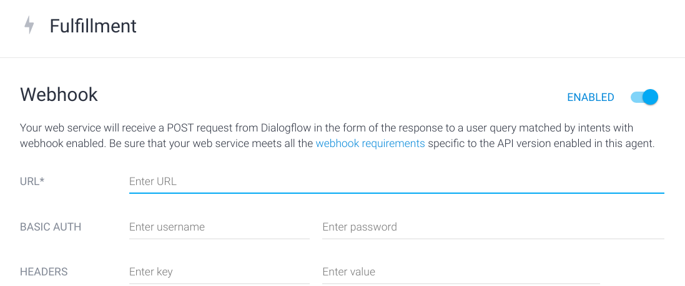
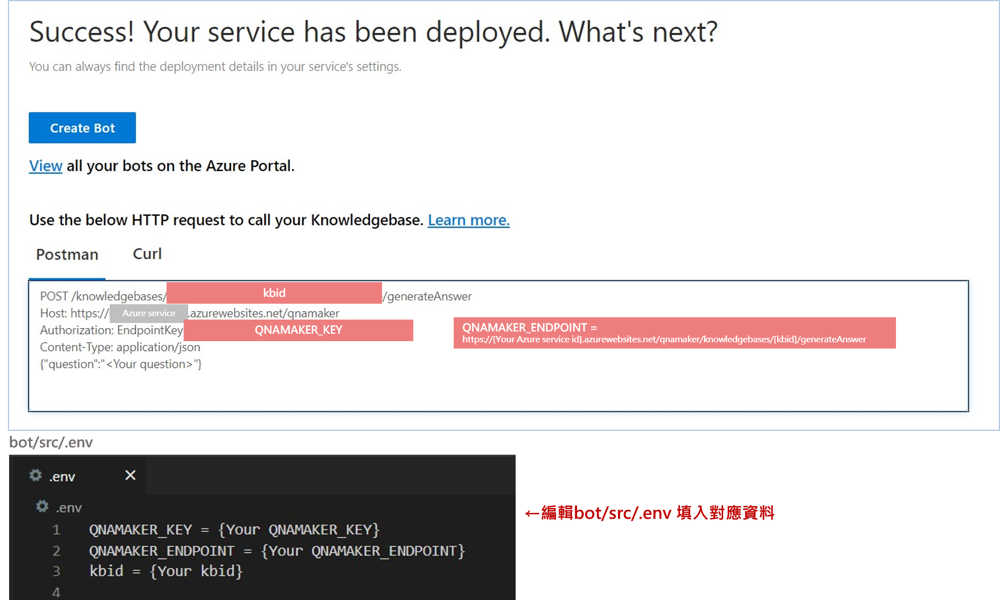

# helpdesk智能IT客服 
## 組名: Bionic Beaver

## 介紹

此 project 主要是架設一個 智能IT客服系統，用戶能夠透過與 chatbot 詢問問題，得到問題的解法，若資料庫目前沒有問題的解法，chatbot 能夠幫助客戶完成報案，並將資料送至後端資料庫，客服人員能夠操作前端網頁去查看、編輯、刪除報案資料，如下圖:


接下來將以 **front end、bot、backend** 三個主題介紹實作方式：

## (一) front end

```
(1) 首先進入 frontend 資料夾: cd frontend/
(2) 執行指令：npm install
(3) 執行指令: npm run build
(4) 執行指令: npm run start
```

做完上述步驟後，便能打開客服人員的操作介面: FAQ Manerger (下圖為操作說明)


  
## (二) bot

### 1. 執行專案

```
(1) 進入bot/src資料夾: cd bot/src/
(2) 編輯.env檔案，內容詳見下方 2. QnA Maker 設定
(3) 回到bot資料夾: cd ..
(4) 執行指令：npm install
(5) 執行指令: npm run build
(6) 執行指令: npm run start
(7) 開啟 dialogflow 進入 fulfillment
(8) 開啟 webhook 功能並填入與 bot 互動之後端 URL
```



### 2. QnA Maker 設定:

(1) 建立 QnA Maker knowledge base https://www.qnamaker.ai/Create

(2) 點入剛剛建立的 knowledge base 頁面

(3-1) 匯入問答集 → 進入 Settings，在 Import knowledge base 處匯入 ```bot/data/IT_qna_data.xlsx```

(3-2) 手動新增問答 → 進入 Edit，點選 Add QnA pair，即可新增問答


(4) 匯入問答集/新增完問答後，點選 Publish

(5) 編輯 ```bot/src/.env``` 檔案，填入對應的QNAMAKER_KEY、QNAMAKER_ENDPOINT 以及 kbid



ps. Azure service id 可在 My knowledge bases 頁面可見

### 3. 加入Telegram機器人

(1) 在聯絡人頁面中搜尋 ```@tsmc_testbot```

(2) 點選「開始」以啟用 Chatbot

(3) 即可開始向 Helpdesk 智能IT客服 詢問問題


### 4. Chatbot 架構


* **welcome intent**: 當使用者對 Chatbot 打招呼，Chatbot 詢問使用者遇到什麼問題

* **question intent**: 接受使用者的問題後從 Azure QnA Maker 尋找問題答案，並將答案回傳給使用者

* **continue intent**: 詢問使用者是否得到幫助

* **ask report intent**: 詢問使用者是否需要報案

* **report intents**: 詢問使用者工號，手機電話和部門名稱

* **confirm intent**: 詢問使用者輸入資料是否正確，若資料不正確則開始重新輸入

* **fallbacks**: 當 Chatbot 無法辨識使用者意圖，則會進入 fallback 詢問使用者相同問題，並提供選項讓使用者回答
  
## (三) backend

* 後端以Fastify框架、Typescript與MongoDB實作

```
(1) backend: cd backend
(2) 執行指令: npm install
(3) Run MongoDB with docker: docker run -d -p 27017:27017 mongo
(4) 執行指令: tsc
(5) 執行指令: npm run start
```

* 使用fastify-swagger生成API Spec

  API Spec : https://8871f05b36ce.ngrok.io/documentation/


* 使用 Jest 做 API 單元測試

  

